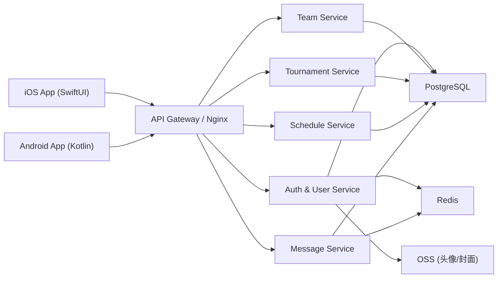

# 前后端分离架构：后端服务清单与 iOS 对接方案

[PROTOCOL]: 变更时更新此头部，然后检查 agents.md

**版本**: v1.1
**日期**: 2026-02-23
**目标**: 支持 iOS 与后续 Android 共享一套独立后端。

---

## 1. 目标架构（前后端分离）

推荐结构：
1. 移动端（iOS/Android）仅做 UI + 本地状态管理 + API 调用。
2. 后端服务独立部署，统一对外提供 REST API（后续可补 WebSocket）。
3. 数据库存储、文件存储、消息分发全部在服务端治理。

---

## 2. 后端必须提供的服务（对应你的 2(a)）

## 2.1 Auth & User Service
职责：
1. Apple 登录鉴权（`identityToken` 验证）。
2. JWT Access/Refresh Token 签发与刷新。
3. 测试环境手机号登录（`phone + code`，由环境开关门控）。
4. 当前用户资料读取与更新（昵称、头像）。
5. 用户搜索（按 `publicId`/昵称）。

核心接口建议：
1. `POST /api/v1/auth/apple`
2. `POST /api/v1/auth/refresh`
3. `POST /api/v1/auth/test-phone`（仅测试环境）
4. `GET /api/v1/users/me`
5. `PUT /api/v1/users/me`
6. `GET /api/v1/users/search`

## 2.2 Team Service
职责：
1. 队伍创建、编辑、解散、退队。
2. 队员管理（移除/角色调整/队长移交）。
3. 入队申请提交与审批。
4. 我的队伍 + 可发现队伍查询。

核心接口建议：
1. `POST /api/v1/teams`
2. `GET /api/v1/teams/my`
3. `GET /api/v1/teams/discover`
4. `GET /api/v1/teams/{teamId}`
5. `PUT /api/v1/teams/{teamId}`
6. `POST /api/v1/teams/{teamId}/join-requests`
7. `POST /api/v1/teams/join-requests/{requestId}:approve`
8. `POST /api/v1/teams/join-requests/{requestId}:reject`
9. `POST /api/v1/teams/{teamId}:transfer-owner`
10. `POST /api/v1/teams/{teamId}/members/{memberId}:toggle-admin`
11. `DELETE /api/v1/teams/{teamId}/members/{memberId}`

## 2.3 Tournament Service
职责：
1. 赛事创建、编辑、列表筛选。
2. 场次创建/编辑/状态流转。
3. A/B 队设置。
4. 阵容保存。
5. 赛果录入。

核心接口建议：
1. `POST /api/v1/tournaments`
2. `GET /api/v1/tournaments`
3. `GET /api/v1/tournaments/{tournamentId}`
4. `PUT /api/v1/tournaments/{tournamentId}`
5. `POST /api/v1/tournaments/{tournamentId}/matches`
6. `PUT /api/v1/matches/{matchId}`
7. `POST /api/v1/matches/{matchId}:assign-teams`
8. `PUT /api/v1/matches/{matchId}/rosters/{teamId}`
9. `POST /api/v1/matches/{matchId}:advance-status`
10. `PUT /api/v1/matches/{matchId}/result`

## 2.4 Schedule Service
职责：
1. 统一查询某时间窗口内可见赛程。
2. 来源维度过滤（我/个人/队伍/赛事）。
3. 支持月历页按日期聚合查询。

核心接口建议：
1. `GET /api/v1/schedule?from=...&to=...`
2. `POST /api/v1/schedule/sources`
3. `GET /api/v1/schedule/sources`
4. `PUT /api/v1/schedule/sources/{sourceId}`
5. `DELETE /api/v1/schedule/sources/{sourceId}`

## 2.5 Message Service
职责：
1. 拉取统一消息流（申请、通知、状态变更）。
2. 消息已读/确认。
3. 事件触发式消息入库（申请提交、审批、赛程变更、赛果录入）。

核心接口建议：
1. `GET /api/v1/messages`
2. `POST /api/v1/messages/{messageId}:ack`

## 2.6 Media Service
职责：
1. 签发 OSS 上传凭证或预签名 URL。
2. 统一媒体访问地址。

核心接口建议：
1. `POST /api/v1/media/avatar-upload-token`
2. `POST /api/v1/media/cover-upload-token`

---

## 3. iOS 如何对接后端（对应你的 2(b)）

## 3.1 对接原则
1. 保留现有 MVVM 结构，不重写 UI。
2. 把 `AppStore` 当前“写内存”动作替换为“调用 Service -> 回填状态”。
3. 通过协议隔离网络层，方便后续 Android 对齐接口、iOS 单测注入 Mock。

## 3.2 建议落地分层
1. `Network`: `APIClient`（URLSession + Token 注入 + 错误映射）。
2. `Service`: `TeamServiceProtocol` / `TournamentServiceProtocol` 等。
3. `Repository`（可选）: 负责 DTO -> Model 映射与本地缓存合并。
4. `ViewModel`: 只管 UI 状态与用户动作。

## 3.3 数据契约建议
1. 所有对象保留 `id`（UUID）与 `publicId`（可见 ID）双标识。
2. 所有写接口返回“最新对象快照”，减少二次查询。
3. 时间字段统一 ISO 8601（UTC），客户端只做展示时区转换。
4. 列表接口统一分页结构：`items + nextCursor`。

## 3.4 对接顺序（建议）
1. 第 1 批：`Auth + User + Team + JoinRequest`（先跑通登录与队伍闭环）。
2. 第 2 批：`Tournament + Match + Roster + Result`（赛事核心链路）。
3. 第 3 批：`Schedule + Message + 推送`（体验增强与运营能力）。

---

## 4. Android 复用保障

只要遵守以下约束，Android 可直接复用：
1. API 语义与字段稳定，不掺杂 iOS 特有字段。
2. 权限规则全部后端判定，不依赖客户端角色假设。
3. 错误码规范化（如 `TEAM_ROLE_FORBIDDEN`, `DUPLICATE_PENDING_REQUEST`）。
4. OpenAPI 文档持续更新，作为 iOS/Android 统一契约。
5. 测试包默认连接阿里云测试环境，应用启动时拦截 `localhost/127.0.0.1` 基址。
6. 安卓测试登录仅允许走 `POST /api/v1/auth/test-phone`，生产环境必须关闭入口。

## 变更日志
- 2026-02-23: 补充 Android 测试包鉴权边界，新增测试手机号登录服务职责与环境门禁。
- 2026-02-17: 迁移并纳入根目录统一文档体系。
